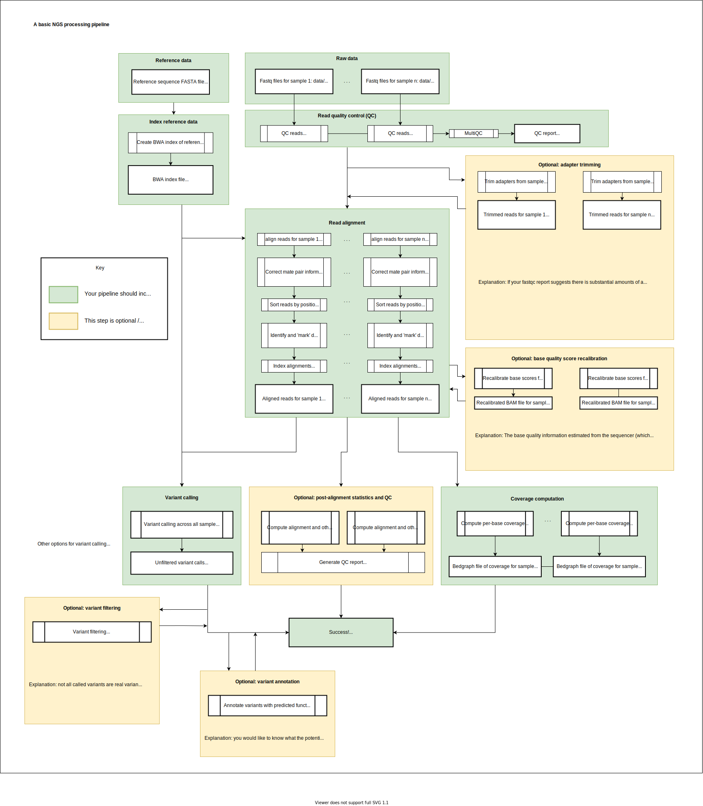

## Implementing a NGS data processing pipeline.

If you've followed the [introduction](README.md), you should now have a bunch of softare installed,
including the `snakemake` pipelining software, and you will have a set of 10 fastq files named in
the format `ERR[xxxxxx]_[1|2].fastq.gz`.  And you will also have downloaded the *P.falciparum* reference sequence, `Pf3D7_v3.fa.gz`.

**Challenge.**  Write a snakemake pipeline that processes these reads.  Your pipeline should:

* take in a set of fastq read files named by accessions as described above.  To keep things well-organised, it's a good idea to put these in a subdirectory, so they will look something like this:

```
   data/reads/ERR377582_1.fastq.gz
   data/reads/ERR377582_2.fastq.gz
   data/reads/ERR377591_1.fastq.gz
   data/reads/ERR377591_2.fastq.gz
   data/reads/ERR377629_1.fastq.gz
   data/reads/ERR377629_2.fastq.gz
   data/reads/ERR417621_1.fastq.gz
   data/reads/ERR417621_2.fastq.gz
   data/reads/ERR417627_1.fastq.gz
   data/reads/ERR417627_2.fastq.gz
```

* output a set of BAM files containing these reads aligned to the a reference sequence.  The reads should be coordinate sorted, duplicates sohuld have been marked or removed, and the reads should be indexed.  My advice is to put results in a seperate subdirectory, so they will look something like this:

```
    results/aligned/QG0033-C.bam
    results/aligned/QG0033-C.bam.bai
    results/aligned/QG0041-C.bam
    results/aligned/QG0041-C.bam.bai
    results/aligned/QG0049-C.bam
    results/aligned/QG0049-C.bam.bai
    results/aligned/QG0056-C.bam
    results/aligned/QG0056-C.bam.bai
    results/aligned/QG0088-C.bam
    results/aligned/QG0088-C.bam.bai
```

* also output a BED file for each sample, reporting the coverage at each site in the genome:

```
    results/coverage/QG0033-C.coverage.bed
    results/coverage/QG0041-C.coverage.bed
    results/coverage/QG0049-C.coverage.bed
    results/coverage/QG0056-C.coverage.bed
    results/coverage/QG0088-C.coverage.bed
```

* also (optionally) output a variant calls file.  These will come in a bgzipped vcf file, which should look like this:

```
    results/variant_calls/variants_calls.vcf.gz
```

* Along the way you will also need to QC the files - we suggest using `fastqc` and `multiqc`.  You might have something like this:

```
    results/qc/QG0033-C.fastqc.html
    results/qc/QG0041-C.fastqc.html
    results/qc/QG0049-C.fastqc.html
    results/qc/QG0056-C.fastqc.html
    results/qc/QG0088-C.fastqc.html
    results/qc/multiqc_report.html
```

.

(The pipeline shown in the diagram has a bunch of optional steps in it, including read adapter trimming.  I suggest leaving these out for now unless you feel you want to.)

### Tips and tricks


##

