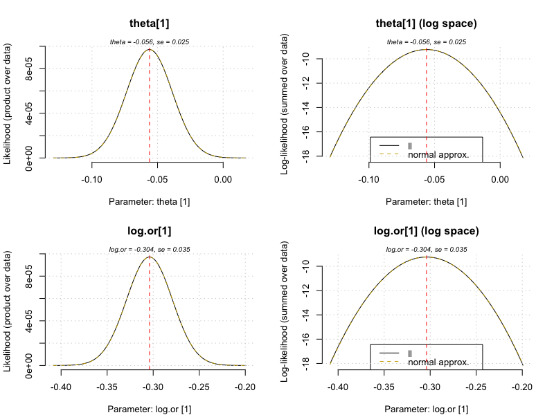
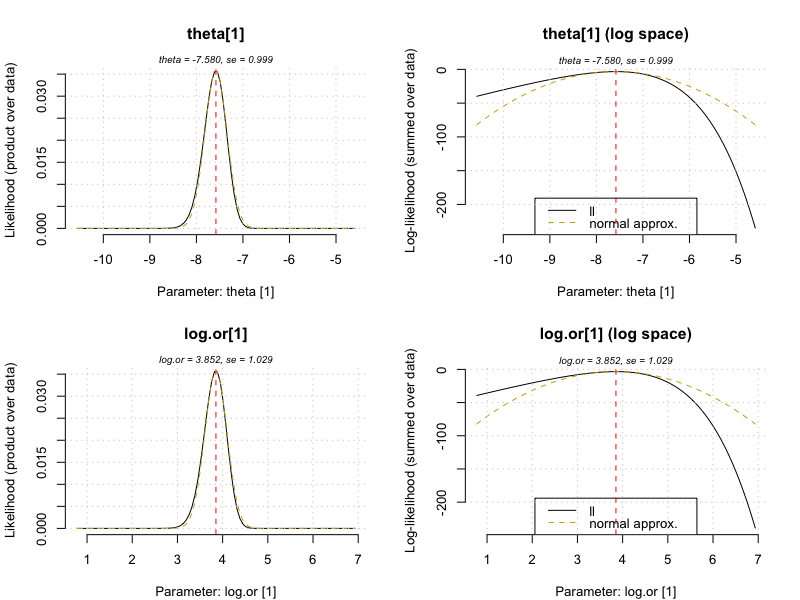

# A tale of two 2x2 tables

Welcome to (possibly) the world's first *choose your own statistical adventure*!

In this practical we are going to study the following two two-by-two tables, which come from two
published papers about genetic variants that affect malaria susceptibility:

```R
                       non-O      O                                          rs60822373   rs60822373
                       blood gp.  blood gp.                                  G allele     C allele
            controls:  3420       3233               unexposed populations:  1965         1
severe malaria cases:  3925       2738         malaria-exposed populations:  707          17
```

The left table contains data from <https://doi.org/10.1038/s41467-019-13480-z>, and shows that O blood group is at
lower frequency in severe malaria cases than in the general population, consistent with a protective effect of O blood
group.

The right table comes from <https://science.sciencemag.org/content/348/6235/711>, and shows that the rs60822373 'C'
alleles is at higher frequency in malaria-exposed population (here sub-Saharan Africans) than in non-exposed
populations (European-ancestry individuals). rs60822373 encodes the Cromer blood group, so this is consistent with a
protective effect of the Cromer blood group on malaria. (In this right table, the data actually comes from the [1000
Genomes Project phase I](http://www.nature.com/nature/journal/v491/n7422/full/nature11632.html)).

If you run a statistical test on either table you will see that these are highly statistically significant differences
in frequencies between the two rows of each table, so these differences are not just due to sampling.

But *something is wrong with one of these tables*.  Your mission is to find out what!

*QN*.  Maybe you can already see what is wrong?  Give it some thought before we proceed.

## Modelling 2x2 tables

To quantify the effects in both tables we need a model. In both tables, the data was collected based on the row labels
(i.e. case/control or population of collection) so the most straightforward model is of *binomial sampling in rows*.
In other words, for a table:
```

           X    Y        (total)
unexposed  a    b        (N₁ = a+b)
  exposed  c    d        (N₂ = c+d)
```
We model the counts of `Y` as:
```  
  b ~ binomial( n = N₁, p = ϑ₁ )
  d ~ binomial( n = N₂, p = ϑ₂ )
```
where ϑ₁ and ϑ₂ are frequencies in the two rows.

*Exercise* You can implement this model easily using the code we have already written - see [this file](../loglikelihoods/table.ll.R) for an implementation.

However, we'd really like to parameterise the model so that it contains an *effect size parameter* - a parameter that
reflects how different the two row frequencies are.  We will use the *log odds ratio* to do this.  In the above table, the observed log odds ratio is the quantity:


There are a couple of reasons to focus on log odds ratio here.  One of them is mathematical convenience.  For a probability p, the odds is defined as p/(1-p).  The odds lies in [0,∞] and thus the log-odds lies in [-∞,∞].  It is generally useful to have parameters living in an unbounded space.

Thus, transforming to log odds allows us to put our parameters on the real line.

Another way to think of this is through the inverse function, which maps log odds back to probability space.  This function is known as the *logistic* function and defined by:


Let's plot it:
```R
logistic <- function( x ) {
	exp(x) / ( 1 + exp(x) )
}

x = seq( from = -10, to = 10, by = 0.01 )
plot( x, logistic(x), type = 'l', bty = 'n' )
grid()
```


You can see that the logistic function maps the real line (log-odds space, x axis) to the unit interval (y axis, probability space).  It is smooth and tails off to being essentially flat outside around [-10,10].

*Exercise* prove that `logistic()` is the inverse of the log odds (substitute one expression into the other and simplify). Alternatively, prove this to yourself by implementing both function in R.

*Exercise* (advanced) what is the slope of the logistic function at x=0?  (Hint: you need to compute the derivative.)

Now that we are working in log-odds space (on the real line), this frees us up to express our log odds as a *baseline log odds* (applying to both rows of the table) plus an *additional log odds conferred by the second row*.  Let's call these parameters μ and β.  We are thus writing:


Or equivalently:


such that β is the log odds ratio.

How does this look in practice?  Lets implement it:

```R
# Requires binomial.ll first!
table.ll <- function( data, params = list( theta = c( 0.5, 0.5 )) ) {
    # For a 2x2 table we assume binomial sampling in rows
    # So sum the lls over the rows
    return (
        binomial.ll(
            x = data[1,2],
            params = list(
                n = rowSums( data )[1],
                p = params$theta[1]
            )
        )
        + binomial.ll(
            data[2,2],
            params = list(
                n = sum( data[2,] ),
                p = params$theta[2]
            )
        )
    )
}

logistic <- function( x ) {
	exp(x) / ( 1 + exp(x) )
}

reparameterised.table.ll <- function( data, params = list( theta = 0.5, log.or = 0 )) {
	# params[1] is log-odds of baseline frequency
	# params[2] is log odds ratio
	theta = c(
		logistic( params$theta ),
		logistic( params$theta + params$log.or )
	)
	return( table.ll( data, params = list( theta = theta )))
}

```

(These functions rely on [binomial.ll](../loglikelihoods/binomial.ll)).

Let's load up the tables:

```
tables = list(
	case_control = matrix(
		c( 3420, 3233, 3925, 2738 ),
		byrow = T, ncol = 2,
		dimnames = list(
			c( "non-O", "O" ),
			c( "controls", "cases" )
		)
	),
	exposure = matrix(
		c( 1965, 1, 707, 17 ),
		byrow = T, ncol = 2,
		dimnames = list(
			c( "G", "C" ),
			c( "unexposed", "exposed" )
		)
	)
)
```

And plot the likelihood (this uses [inspect.ll](../loglikelihoods/inspect.ll)).)
```
fit1 = inspect.ll( reparameterised.table.ll, data = tables[[1]], params = list( theta = 0.5, log.or = 0 ) )
fit2 = inspect.ll( reparameterised.table.ll, data = tables[[2]], params = list( theta = 0.5, log.or = 0 ) )
```

Look at both these plots.  For the first table:



The plot for the first table is about as good as this plot could look.  It estimates a log odds-ratio of -0.30, which is an odds ratio of ~0.74.  Also, the Gaussian fit to the likelihood is about as good as it could possibly be.  We could get a reasonable interval as:
```R
   > sprintf(
       "%.2f ( %.2f - %.2f)",
       exp( fit1$mle$log.or ),
       exp( fit1$mle$log.or - 1.96 * fit1$standard.errors[1] ), exp( fit1$mle$log.or + 1.96 * fit1$standard.errors[1] )
   )
   [1] "0.74 ( 0.70 - 0.77)"
```

As discussed in class, you can interpret this in one of two ways. The bayesian interpretation is that our uncertainty
in the true odds ratio, given this particular data table, is well expressed by a small interval around 0.74. The above
interval is a 95% bayesian *credible interval* for the parameter - meaning an interval that contains 95% of the
posterior mass. (In principle this interpretation depends on assuming a flat prior, so that the posterior is
proportional to the likelihood. But because the data is so strong here, the prior won't affect this much as long as the
prior is relatively spread out). The posterior is pretty much Gaussian, so the probability that the parameter was
actually zero, or something above zero, can be computed from the quantiles of the Gaussian distribution:
```R
> pnorm( 0, mean = fit1$mle$log.or, sd = fit1$standard.errors[2], lower.tail = F )
[1] 1.711726e-18
```
meaning that (assuming the model holds) it's vanishingly unlikely we have got the sign of this effect wrong.

*Note* this is a bit daft because we shouldn't be allowed a 'flat prior' here (there's no function that integrates to 1 over the whole real line).  And in any case a 'flat prior' would place most of its mass outside any finite interval so this prior really claims that the effect is huge.  Adding a *proper prior* here is not hard - 

*Exercise* add a proper prior here (e.g. Gaussian with mean 0 and standard deviation sigma) - how does this change the above?

Alternatively, we discussed in lectures how this can be interpreted as a frequentist statement about the parameter. In
this setting we think of *replicates of the table from the same sampling process* and interpret the above interval as a
*confidence interval*. To state this specifically, it means:

* Imagine an infinite number of replicates of the data with some 'true' parameters
* Imagine for each such data table we used the above procedure to compute a confidence interval
* *Then* the true parameter would be in the computed interval 95% of the time.

If this strikes you as a complicated interpretation - it is! My general advice is to interpret this interval as a
statement about our uncertainty in the parameter given the model - i.e. as a bayesian credible interval. In more
general situations with less informative data you should think carefully about what prior is appropriate. Where the
frequentist approach becomes useful is in *calibrating* or *model checking* our model against reality.  In this case it's useful to know that *if the true log-odds were zero*, then the estimate would be distributed like


so that a one-tailed P-value can be computed from quantiles of this normal distribution:

```R
> pnorm( abs(fit1$mle$log.or), mean = 0, sd = fit1$standard.errors[2], lower.tail = F )
[1] 1.711726e-18
```

*Exercise* This number is of course exactly equal to the Bayesian probability of getting the sign wrong above - satisfy yourself why this is true.

## When asymptotics go wrong 

On the other hand, look at the plot for the 2nd table:



Clearly something goes wrong with the asymptotics for this table.  The Gaussian approximation is not great.  Focussing on the log-odds ratio parameter, the approximation puts *too little weight* on small odds ratios, and it puts *too much weight* on larger odds ratios.  If we again compute a P-value

```R
> pnorm( abs(fit2$mle$log.or), mean = 0, sd = fit2$standard.errors[2], lower.tail = F )
[1] 9.020974e-05
```

it is still statistically significant - but we should be cautious because the gaussian approximation is not great.

Here are two ways to deal with this.  First, we could use *Fisher's exact test* intead.  Fisher's exact test deals with this situation by additionally conditioning on the column sums of the table.  This is like saying we knew what the frequency of the variant was beforehand
